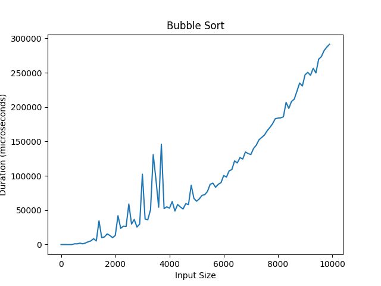
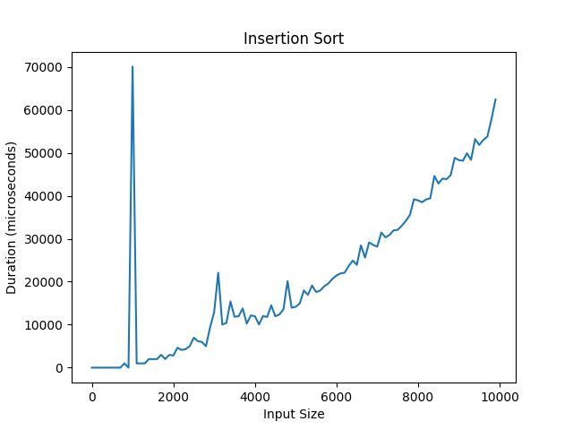
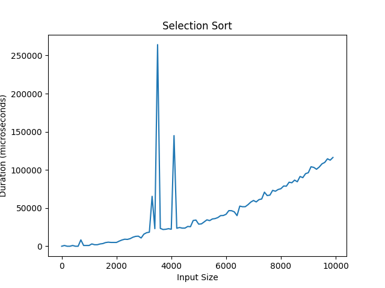
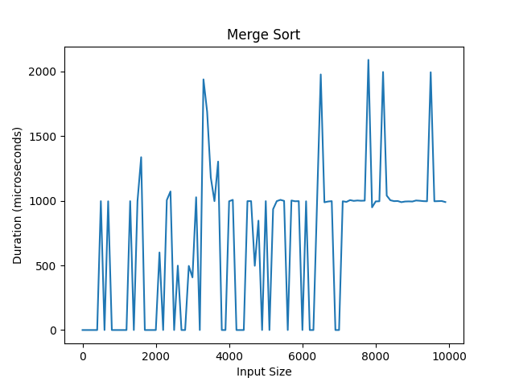
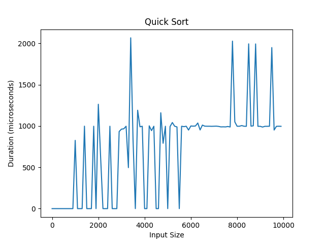
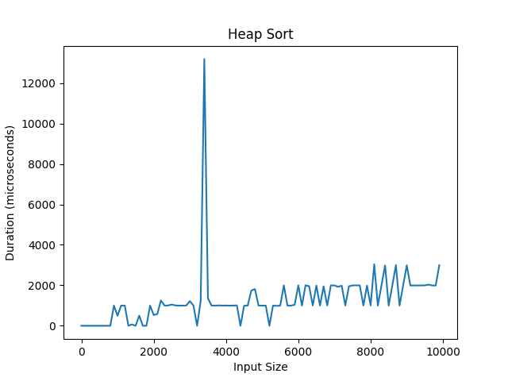
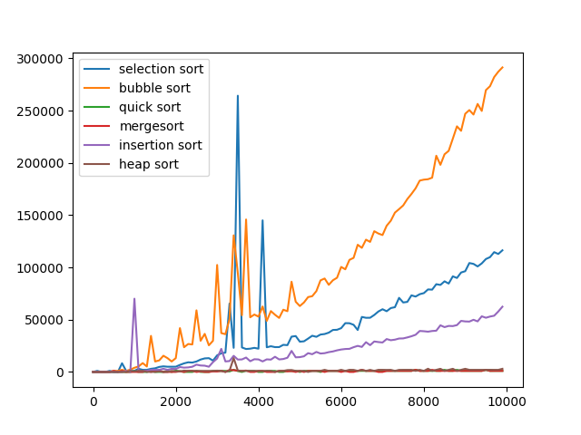

# Sorting algorithms

In this project, I have implemented various sorting algorithms such as bubble sort, insertion sort, selection sort, quicksort, mergesort, heapsort. These algorithms are implemented in c++ and the graphs comparing their sorting time of the algorithms are created using python. No any citation and any installations. 

This project is based on the goodreads data, the current project helps us to understand how various sorting can be used to implement the sorting techniques on the previous dataset.

This project gives us an insight on how the various algorithms affect the runtime of the program depending on the size of the dataset.
 
The execution time of these function is calculated using the chrono library in c++.
After all the functions are tested for their execution time, all the data regarding their execution time is stored in output files in the data folder.
Once the data is stored in the folders, the c++ program makes a call to the python script which in turn reads from the previously generated data folders, which contains the execution time of the various algorithms.
After reading the data, the python scripts plots the graph for the algorithms, the graphs are plotted between the size of array vs the execution time in microseconds.
The python script makes use of matlpotlib library to create the graphs.	Once these graphs are created and displayed they are saved in the images folder. I completed this project with two teammates. I mainly responsible for the python part and explain each plot. 

### Output

Output:

1.Bubble Sort is the simplest sorting algorithm that works by repeatedly swapping the adjacent elements if they are in the wrong order. This algorithm is not suitable for large data sets as its average and worst-case time complexity is quite high.

As we can observe tat bubble sort uses a brute force approach hence It has a larger time complexity
Time complexity: O(n^2)

2.Insertion Sort:
Insertion sort is a simple sorting algorithm that works similar to the way you sort playing cards in your hands. The array is virtually split into a sorted and an unsorted part. Values from the unsorted part are picked and placed at the correct position in the sorted part.

TIme complexity: O(n^2)

Selection sort:
The selection sort algorithm sorts an array by repeatedly finding the minimum element (considering ascending order) from the unsorted part and putting it at the beginning. 

The algorithm maintains two subarrays in a given array.
1.The subarray which already sorted. 
2.The remaining subarray was unsorted.
In every iteration of the selection sort, the minimum element (considering ascending order) from the unsorted subarray is picked and moved to the sorted subarray. 
the main portpyy is how to save the real imformarun

Time complexity:
O(n^2)

3.Merge Sort:
The Merge Sort algorithm is a sorting algorithm that is based on the Divide and Conquer paradigm. In this algorithm, the array is initially divided into two equal halves and then they are combined in a sorted manner.

Time complexity: O(n*log(n))

4.Quicksort:
Like Merge Sort, QuickSort is a Divide and Conquer algorithm. It picks an element as a pivot and partitions the given array around the picked pivot. There are many different versions of quickSort that pick pivot in different ways. 

1.	Always pick the first element as a pivot.
2.	Always pick the last element as a pivot (implemented below)
3.	Pick a random element as a pivot.
4.	Pick median as the pivot.
The key process in quickSort is a partition(). The target of partitions is, given an array and an element x of an array as the pivot, put x at its correct position in a sorted array and put all smaller elements (smaller than x) before x, and put all greater elements (greater than x) after x. All this should be done in linear time.

5.Heapsort: 
Heap sort is a comparison-based sorting technique based on Binary Heap data structure. It is similar to the selection sort where we first find the minimum element and place the minimum element at the beginning. Repeat the same process for the remaining elements.

Time complexity:O(n*log(n))

Combined:
Bubble sort and Insertion sort – 
Average and worst case time complexity: n^2 
Best case time complexity: n when array is already sorted. 
Worst case: when the array is reverse sorted
Selection sort – 
Best, average and worst case time complexity: n^2 which is independent of distribution of data. 
 
Merge sort – 
Best, average and worst case time complexity: nlogn which is independent of distribution of data. 
 
Heap sort – 
Best, average and worst case time complexity: nlogn which is independent of distribution of data. 
 
Quick sort – 
It is a divide and conquer approach with recurrence relation: 

As we can observe from the above figure that the bubble sort is the slowest of all since it follows a brute force approach whereas heap sort seems to be the quickest one. 

